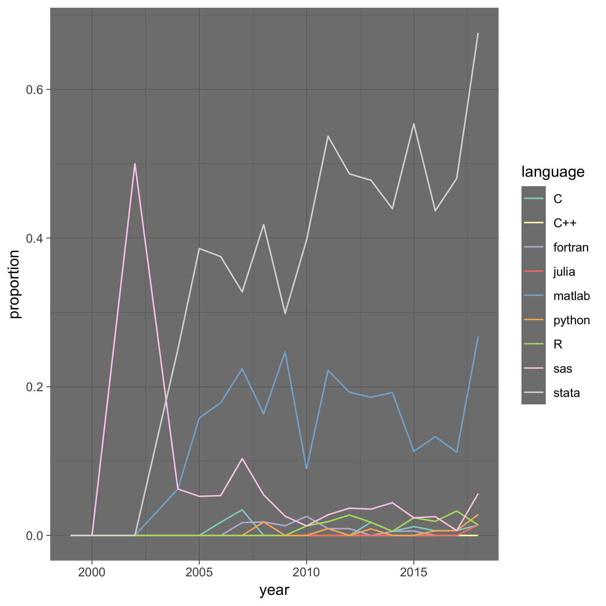

... although some are not frequently asked, but might nevertheless be useful. Below questions and answers in random order.

### What is the DOI of my openICPSR deposit? I have not yet published it, but am asked to add a citation to it in my manuscript?

 Generically, each openICPSR project has a number (e.g., "109622"), that might show up on the right panel:
  
 Then

- if the openICPSR project has not been published, then the DOI is "http://doi.org/10.3886/E" + number + "V1" (e.g. http://doi.org/10.3886/E109622V1)
- if the openICPSR project has already been published, then the CURRENT DOI is shown on the relevant page, but if there are any revisions the Data Editor has asked for, then the to-be-cited DOI would be the next version, e.g., "http://doi.org/10.3886/E" + number + "V3" if the current version is V2 and the next version would be V3.

Give it a try:

<form id="myForm">
  Project number <input type="text" name="projectid"> 
  Version number <input type="text" name="versionnum" value="V1"> 
  <input type="button" onclick="myFunction()" value="Compute DOI">
</form>

###  Should we keep the data and directory structure as we used it ourselves or should we set up the files in a way that would make replication as straightforward as possible?

> ... the directory structure has gotten a little clunky over the years working on this project...

The Data and Code Availability Policy   says:

> "Files uploaded to the AEA Data and Code Repository should retain the file names as originally executed or used, their original file format, and their original "grouping" in terms of directories."

You should feel free to reorganize, but you should ensure when we run the reorganized files, they produce the **same results that are reported in the paper**. Or put differently, the numbers in the paper should be produced by the reorganized files. We are not trying to reproduce your historical path to the paper, only the current state of the paper.

Such restructuring may also be appropriate if you have a very sophisticated reproducible setup in your lab or group. A replicator does not need all sorts of fancy dynamics setup scripts that are very relevant in a lab, but unnecessarily complicate the process for a replicator. You should feel to simplify the final setup to make it easy for anybody to run this particular project, once.

### The paper uses confidential data, covering [geography] for period [2001-2015]. The repository only contains code. Should the repository metadata be filled out for the data characteristics, even if the repository only has code?

[Answer from ICPSR] I think it still makes sense to complete as much metadata as possible.  There are syntax files specific to the data available through a restricted-use agreement.  The metadata are for increasing findability of the data collection -- even if only the syntax are in the repository.  It's useful to know the data analyzed with the syntax are about a specific geographic coverage  for a specific time period.

### We already use git/svn/GitHub/GitLab/BitBucket/etc. Do you facilitate integration of existing version-controlled code to the AEA repo? Or even planned functionality for linking out directly to such projects where they can be found online?

We are open to linking out to existing **archives** of code and data. However, GitLab & Co. are not archives! See the relevant section on [Social Science Data Editors pages](https://social-science-data-editors.github.io/guidance/Requested_information_hosting.html#not-acceptable).

However, in principle, that does not preclude linking out to **live** code on such platforms. At present, we have no concrete plans, but we are considering various ways to make articles and their landing pages more informative.

In the short term, treat a Github repo as any other URL, and cite it, in addition to [creating a proper archive from it](https://guides.github.com/activities/citable-code/). You can also elaborate more freely in the README. 

### Some econometrics papers might be accompanied by (for example) an R or Stata package (perhaps published on CRAN or SSC). What about surfacing references to associated packages more prominently?

First, packages on [CRAN](https://cran.r-project.org/) and the [Statistical Software Components](https://ideas.repec.org/s/boc/bocode.html) can be cited. AEA citation guidance is currently silent on software components, but it is not wrong to cite them, and other disciplines do it regularly. [CRAN](https://cran.r-project.org/) in fact has elements of a "proper archive" (SSC does NOT). All R packages can [generate a (Bibtex) citation](https://stat.ethz.ch/R-manual/R-devel/library/utils/html/citation.html). 

Second, it is possible to submit such packages to various journals, where they are reviewed and published with DOI:
- [R Journal](https://journal.r-project.org/)
- [Stata Journal](https://www.stata-journal.com/)
- [Journal of Statistical Software](https://www.jstatsoft.org/)

### Do you support Docker/ Jupyter/ etc.?

The generic answer is yes. The key is to make it clear in the README how to run the software. Most economists know how to run Stata, Matlab, and probably figure out how to run R or Julia even if it is not their native programming environment. For software that is less standard (GIS, SQL databases, Docker, Jupyter notebooks, cloud-based compute clusters), we suggest pointing to (citing) an introductory tutorial on the web in the README, and providing a barebones set of instructions on how to get started.
The picture below illustrates what software can be considered to be "common" amongst economists (credit: Patrick Baylis, [doi.org/10.5281/zenodo.1456185](http://doi.org/10.5281/zenodo.1456185)).

