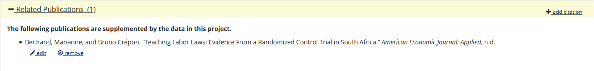

... although some are not frequently asked, but might nevertheless be useful. Below questions and answers in random order. Please be sure to check out the [official list of FAQ](https://www.aeaweb.org/journals/data/faq) first. Should you have other questions not appearing on either page, please [create a new issue on Github](https://github.com/AEADataEditor/aea-de-guidance/issues/new), ask the question on [Twitter](https://twitter.com/aeadata), or send an email to the [AEA Data Editor](mailto:dataeditor@aeapubs.org).

### What is the DOI of my openICPSR deposit? I have not yet published it, but am asked to add a citation to it in my manuscript?

 Generically, each openICPSR project has a number (e.g., "109622"), that might show up on the right panel:
  
 Then

- if the openICPSR project has not been published, then the DOI will be "http://doi.org/10.3886/E" + number + "V1" (e.g. http://doi.org/10.3886/E109622V1)
- if the openICPSR project has already been published, then the CURRENT DOI is shown on the relevant page, but if there are any revisions the Data Editor has asked for, then the to-be-cited DOI would be the next version, e.g., "http://doi.org/10.3886/E" + number + "V3" if the current version is V2 and the next version would be V3.

Give it a try:

<form id="myForm">
<table>
 <tr><td>Article title:</td> <td> <input type="text" name="title"></td></tr>
  <tr><td>Authors:</td> <td> <input type="text" name="title"></td></tr>
  <tr><td>Project number:</td> <td> <input type="text" name="projectid"></td></tr>
  <tr><td>Version number:</td> <td> <input type="text" name="versionnum" value="V1"></td></tr>
  <tr><td></td> <td><input type="button" onclick="myFunction()" value="Compute DOI"></td></tr>
  </table>
</form>

<table>
<tr><td>

</td></tr></table>

### How do I cite my own data and code supplement?

If you created your own data (experiments, surveys, etc.), you should do one of two things:

- If you believe that you will re-use the data as-is, and in particular if you would like others to also use the data, we strongly suggest creating a separate data deposit at a data repository. This deposit does not need to be at the AEA Data and Code Repository - it can be at any trusted repository. Have a look at the [Social Science Data Editor's guide to Data and Code Hosting](https://social-science-data-editors.github.io/guidance/Requested_information_hosting.html). Once deposited, and published, the data should be cited in your manuscript, in accordance with the [AEA Sample References](https://www.aeaweb.org/journals/policies/sample-references).
- If you only intend to write this one manuscript with the data, you should cite the manuscript's companion data and code deposit at the AEA Data and Code repository. Since that deposit is (typically) not yet published, you need to manually construct the reference, as per the [AEA Sample References](https://www.aeaweb.org/journals/policies/sample-references) (an example is given there). The DOI for your forthcoming data and code deposit can be constructed as outlined in the previous FAQ.

###  Should we keep the data and directory structure as we used it ourselves or should we set up the files in a way that would make replication as straightforward as possible?

> ... the directory structure has gotten a little clunky over the years working on this project...

The Data and Code Availability Policy   says:

> "Files uploaded to the AEA Data and Code Repository should retain the file names as originally executed or used, their original file format, and their original "grouping" in terms of directories."

You should feel free to reorganize, but you should ensure when we run the reorganized files, they produce the **same results that are reported in the paper**. Or put differently, the numbers in the paper should be produced by the reorganized files. We are not trying to reproduce your historical path to the paper, only the current state of the paper.

Such restructuring may also be appropriate if you have a very sophisticated reproducible setup in your lab or group. A replicator does not need all sorts of fancy dynamic setup scripts that are very relevant in a lab, but unnecessarily complicate the process for a replicator. You should attempt to simplify the final setup to make it easy for anybody to run this particular project, once.

### The paper uses confidential data, covering [geography] for period [2001-2015]. The repository only contains code. Should the repository metadata be filled out for the data characteristics, even if the repository only has code?

[Answer from ICPSR] I think it still makes sense to complete as much metadata as possible.  There are syntax files specific to the data available through a restricted-use agreement.  The metadata are for increasing findability of the data collection -- even if only the syntax are in the repository.  It's useful to know the data analyzed with the syntax are about a specific geographic coverage  for a specific time period.

### I use confidential data. I am allowed to provide the data to the Data Editor for the purpose of replication, but you are not allowed to publish the data. How do I proceed?

[Moved to main FAQ](https://www.aeaweb.org/journals/data/faq#confidential) 

### We already use git/svn/GitHub/GitLab/BitBucket/etc. Do you facilitate integration of existing version-controlled code to the AEA repo? Or even planned functionality for linking out directly to such projects where they can be found online?

[Moved to main FAQ](https://www.aeaweb.org/journals/data/faq#existing) 

### Some econometrics papers might be accompanied by (for example) an R or Stata package (perhaps published on CRAN or SSC). What about surfacing references to associated packages more prominently?

[Moved to main FAQ](https://www.aeaweb.org/journals/data/faq#package)

### Do you support Docker/ Jupyter/ etc.?

[Moved to main FAQ](https://www.aeaweb.org/journals/data/faq#support)

### I have been told by the Data Editor to remove PSID data from my submitted materials. What do I do?

[Moved to main FAQ](https://www.aeaweb.org/journals/data/faq#psid) 

### Aligning AEA RCT Registry and AEA Data and Code Repository

The [AEA RCT registry](https://www.socialscienceregistry.org) has a field that codes whether data associated with a registration is publicly available. Many authors will have this coded as "non public" prior to the publication of the replication package. When the replication package is about to be published on the [AEA Data and Code Repository](https://www.openicpsr.org/openicpsr/aea), this field needs to be updated. Only the authors of the registry can update this field. Steps to follow:

- Log in to the [AEA RCT registry](https://www.socialscienceregistry.org) and select your registration
- Change the field to "public" / "published"
- [Compute the DOI](#what-is-the-doi-of-my-openicpsr-deposit-i-have-not-yet-published-it-but-am-asked-to-add-a-citation-to-it-in-my-manuscript) of your forthcoming replication package publication and enter the resulting DOI in the URL field. 
    - **Do not use** the URL of the openICPSR project in the browser address bar!

[EXTRA] You should also record the RCT DOI as a related publication of your deposit on the  [AEA Data and Code Repository](https://www.openicpsr.org/openicpsr/aea):

- The RCT registry will show the DOI of your registration at the bottom of its public page. [Example](https://www.socialscienceregistry.org/trials/156):

- You can then enter that DOI (e.g., `10.1257/rct.156-1.1`) into the "Related Publication" field of the deposit on the AEA Data and Code Repository:

- Choose the "Import via DOI" button:

- Fill in the DOI (e.g., `10.1257/rct.156-1.1`) and press "Import":

- Select "`is supplemented by`" and press "Save and Apply"

