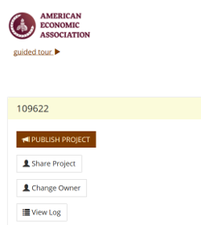

This page describes how to provide code and data to be linked to manuscripts in the AEA Papers and Proceedings.

- all authors are encouraged to follow the AEA's [Data and Code Availability Policy](https://www.aeaweb.org/journals/policies/data-code).
- all authors are required to follow the instructions for **Transmission of Data and Code Materials** noted therein, repeated here for convenience:

> **Transmission of Data and Code Materials**

>    [Instructions](https://www.openicpsr.org/openicpsr/aea/deposit-instructions) on how to deposit materials at the AEA Data and Code Repository are provided at openICPSR, with additional instructions available [here](https://aeadataeditor.github.io/aea-de-guidance/data-deposit-aea-guidance.html).

### Materials to provide
- [ ] README in TXT or PDF format (see our [template README](https://aeadataeditor.github.io/aea-de-guidance/template-README.html) for guidance on content)
- [ ] Code for all tables, figures, and in-text numbers of the manuscript
- [ ] Data for the above, if available
- [ ] Information on how to access the data, if not

### Ideal structure

Your deposit should have
- no redundant directories: the first thing you should see is the README and any subdirectories
- there should be no ZIP files!
- the structure should be as you last ran the code

> [NOTE] The AEA staff will not re-arrange or otherwise restructure your deposit in any way. What you see in the deposit interface is what others will see once it is published.

You should see something like this:
```
data_directory/
prog_directory/
README.pdf
LICENSE.txt
```
(the `LICENSE.txt` is optional if you want to adopt one of the standard openICPSR licenses).

### Additional Information to Provide upon Deposit

We ask that you fill out sufficient metadata upon deposit to make the deposit findable, and useful. This is described in more detail at [our supplemental guidance page](hdata-deposit-aea-guidance.md).

#### Required elements

The following elements are **required**:

- [ ] Title (Suggested: "*Data and code for: (NAME OF PAPER)*")
- [ ] "Principal Investigators" (=Authors; these need not be in the same order)
- [ ] JEL Classification (can be the same as article)
- [ ] Manuscript Number (your P&P manuscript number as assigned by the editorial office, e.g., "PandP-2019-0000")

#### Highly recommended

The following elements are highly recommended for better inclusion in search engines:

- [ ] Subject Terms (e.g., "Machine Learning", "Randomized Control Trial", "Nudges", ...)
- [ ] Geographic coverage (e.g, "United States", "Florida, U.S.", "Indonesia", ...)
- [ ] Time period(s)  (e.g., "1982-2008")

#### Suggested

The following elements are suggested for certain types of data, and may not apply to all types of data:

- [ ] Collection date(s) 
- [ ] Universe (e.g., "All households in Canada", "Manufacturing establishments in Indonesia", ...)
- [ ] Data Type(s) 
- [ ] Data Source 
- [ ] Units of Observation 


### Citing Your Deposit

At present (2020), the openICPSR repository does not display the Digital Object Identifier (DOI) that will be associated with your deposit. However, it can be deduced easily.

- Each openICPSR project has a number (e.g., "109622"), that might show up on the right panel:

  

- if the openICPSR project has not been published, then the DOI will be "http://doi.org/10.3886/E" + number + "V1" (e.g. **http://doi.org/10.3886/E109622V1**)
- if the project has already been published before, and you are updating it, then the "V1" will be incremented. See [our FAQ](FAQ.md)
- You should then cite your deposit as follows (see [AEA Sample References](https://www.aeaweb.org/journals/policies/sample-references)):

|  |
|----|
| **Romer, Christina D., and David H. Romer**. 2010. "Replication data for: The Macroeconomic Effects of Tax Changes: Estimates Based on a New Measure of Fiscal Shocks." *American Economic Association* [publisher], Inter-university Consortium for Political and Social Research [distributor]. https://doi.org/10.3886/E112357V1. |
| |

#### Give it a try:

<form id="myForm">
<table>
 <tr><td>Article title:</td> <td> <input type="text" name="title"></td></tr>
  <tr><td>Authors:</td> <td> <input type="text" name="title"></td></tr>
  <tr><td>Project number:</td> <td> <input type="text" name="projectid"></td></tr>
  <tr><td>Version number:</td> <td> <input type="text" name="versionnum" value="V1"></td></tr>
  <tr><td></td> <td><input type="button" onclick="myFunction()" value="Compute DOI"></td></tr>
  </table>
</form>

<p id="DOI"></p>
<table>
<tr><td>
<p id="citation"></p>
</td></tr></table>

<script>
function myFunction() {
  var doipre = "http://doi.org/10.3886/E";
  var titlepre = "Data and code for:";
  var str0 = document.getElementById('myForm').elements[0].value;
  var authors = document.getElementById('myForm').elements[1].value;
  var str2 = document.getElementById('myForm').elements[2].value;
  var str3 = document.getElementById('myForm').elements[3].value;
  var title = titlepre.concat(str0);
  var doi = doipre.concat(str2).concat(str3);
  document.getElementById("citation").innerHTML = "<b>" + authors + "</b>. 2020. \"" + title + "\" <i>American Economic Association</i> [publisher], Inter-university Consortium for Political and Social Research [distributor]. " + doi;
  document.getElementById("DOI").innerHTML = "<i>Your DOI will be: </i> <b>" + doi + "</b>";
  
}
</script>

### Review by AEA

AEA Staff will review the metadata and structure of the deposit, and may provide feedback. AEA Staff will not manipulate, modify, or otherwise change data, code, text, or metadata. 