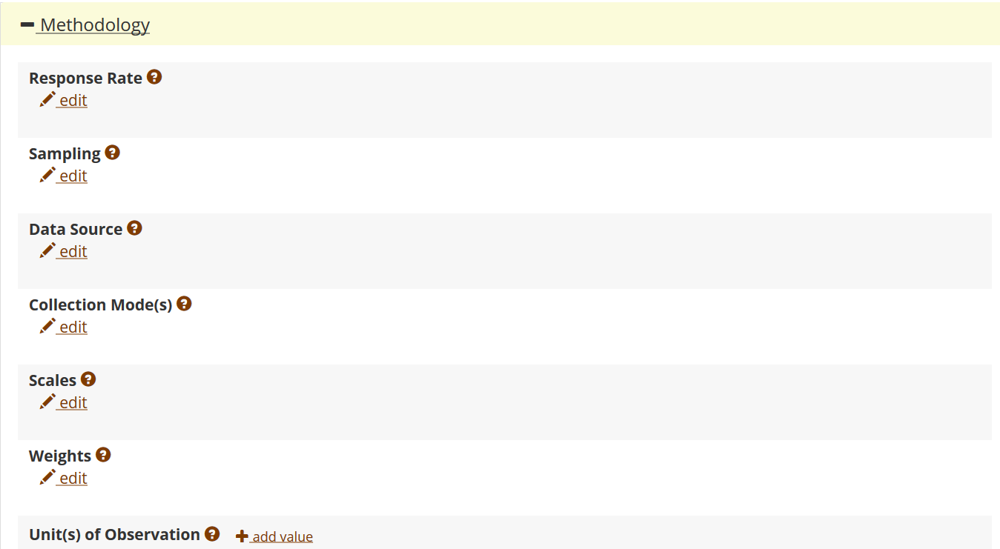

### Prior to upload

Please verify:
- [ ] your manuscript includes data citations (we provide summary [guidance here](https://www.aeaweb.org/journals/policies/sample-references), and some [additional guidance here](addtl-data-citation-guidance.md))
- [ ] you have prepared a README that provides all the relevant information, as per the [README template](https://social-science-data-editors.github.io/guidance/template-README.html) recommended by multiple data editors in economics.
- [ ] your data and code deposit contains all code, including code to read in raw data, even when the data cannot be provided.

### General guidelines
Start by following [instructions provided at the Repository](https://www.openicpsr.org/openicpsr/aea/deposit-instructions).

### Checklist

#### Required elements

The following elements are **required**:

- [ ] Title (Suggested: "*Data and code for: (NAME OF PAPER)*")
- [ ] "Principal Investigators" (=Authors; these need not be in the same order). Please ensure that all authors have affiliations (if not affiliated: "Independent Researcher")
- [ ] Abstract (Suggested: The abstract from the article and/or a note that this is data and/or code accompanying the article)
- [ ] JEL Classification (can be the same as article)
- [ ] Manuscript Number (your Scholar One tracking number as assigned by the editorial office, e.g., "AER-2019-0000")
- [ ] README is in PDF or TXT format (Markdown OK)

#### Highly recommended

The following elements are highly recommended for better inclusion in search engines:

- [ ] Subject Terms (e.g., "Machine Learning", "Randomized Control Trial", "Nudges", ...)
- [ ] Geographic coverage (e.g, "United States", "Florida, U.S.", "Indonesia", ...)
- [ ] Time period(s)  (e.g., "1982-2008")

#### Suggested

The following elements are suggested for certain types of data, and may not apply to all types of data:

- [ ] Collection date(s) 
- [ ] Universe (e.g., "All households in Canada", "Manufacturing establishments in Indonesia", ...)
- [ ] Data Type(s) 
- [ ] Data Source 
- [ ] Units of Observation 

### Details


#### Describe the project


  - The **title** should be "`Data and Code for: [Title of article]`"
  - The **authors** should be those who compiled the data and code. This may differ (if necessary) from the article. 
  - The **summary** might be short. It can include the abstract of the article itself. It does not need to include information on the related article (which has its own field). 
  - Identify any **funding sources** here - the information can be queried by some funders, and can assist with your award reporting.

#### Uploading

Upload files in the way you expect the files to be organized in order to run the code. 

> - DO NOT UPLOAD A ZIP FILE - IMPORT IT! 
> - ANY OTHER COMPRESSION FORMAT [RAR,7z, etc.]: CONVERT TO ZIP BEFORE IMPORTING!


- It is possible to **IMPORT a ZIP file** (do **NOT** upload a ZIP file - no ZIP files should be visible in the deposit). Replicators will be downloading a ZIP file that preserves the directory structure.
  - A well prepared ZIP file has NO folder in the root
  - OSX users should [see our FAQ on this topic](https://aeadataeditor.github.io/aea-de-guidance/FAQ.html#what-is-that-__macosx-folder-which-seems-to-contain-a-second-copy-of-all-the--replication-files-i-am-not-sure-why-this-folder-exists)
- Please upload the README (in PDF, TXT, or MD format - no Word documents!) as the very first file - ensuring that it can be found easily by browsers of the archive.
- Please upload the README to the root of the repository - any data and code can be in subdirectories, but it is easier to find the README if it is not in subdirectories.
  - Even better if it is part of your ZIP file that you import.
  - There should be no duplicate README files in the repository
- If the **UNCOMPRESSED** contents of the deposit (the **UNZIPPED** size of the ZIP file) are larger than 30GB, please send an email to the AEA Data Editor to request an increase in the quota. Reasonable requests will be authorized. Size of the deposit is never a reason not to provide materials, as we have found solutions for every single case so far.
- If you have **more than 1,000 files** in your deposit, talk to us before uploading.

#### Ideal structure

Your deposit should have
- no redundant directories: the first thing you should see is the README and any subdirectories
- there should be no ZIP files!
- the structure should be as you last ran the code

> [NOTE] The AEA staff will not re-arrange or otherwise restructure your deposit in any way. What you see in the deposit interface is what others will see once it is published.

You should see something like this:
```
data_directory/
prog_directory/
README.pdf
LICENSE.txt
```
(the `LICENSE.txt` is optional if you want to adopt one of the standard openICPSR licenses upon publication. See [our licensing guidance](Licensing_guidance.md) for other options).


### Additional metadata


**Click on each + to open the related section:**

#### Scope of project section


  - We ENCOURAGE authors to provide additional subject terms
  - Authors **MUST** provide JEL codes (under "Scope of Project")
  - Authors **MUST** provide the **Manuscript Number**, as this will allow us to properly connect the repository with the manuscript.
  - When data are provided, authors are ENCOURAGED to define 
      - the geographical scope(s)
      - the time period(s)
      - the universe(s)
      - data type(s)
  - Most fields are repeatable, please enter as many values as needed. For instance, if subsets of the data cover different periods (e.g., `1999-2019` and `2004-2019`). Just click "add value" next to the time period field for each time period.
  - This information can also be provided when only code is made available.
  - When only code is produced, authors should choose `data type = program source code`: 

#### Methodology section

  
  
  - Methodology is particularly relevant for survey or experimental data:
    - response rates, sampling rates, etc.
  - We ENCOURAGE all authors to define
    - the unit of observation (e.g. individual, firm, establishment, county, country)

#### Related publications section


- Authors can also link back to working papers or related publications that have or will use this (same!) data. 
- Future functionality will automatically list articles (including articles by third parties) that cite the data.

Authors do not need to add  their (forthcoming) publication here. The AEA editorial office will add the bibliographic information prior to publication.

### Submitting to the Data Editor

Once you are satisfied that all data files are present, are complete, and all metadata is satisfactory, including all required elements filled out, you should **submit** the deposit, by changing the **status** of the deposit:


Choose "Submit to AEA" under "Change Status".

Should you have forgotten something, you can "recall" the submission. 

### Citing Your Deposit

At present (2020), the openICPSR repository does not display the Digital Object Identifier (DOI) that will be associated with your deposit. However, it can be deduced easily.

- Each openICPSR project has a number (e.g., "109622"), that might show up on the right panel:

  

- if the openICPSR project has not been published, then the DOI will be "http://doi.org/10.3886/E" + number + "V1" (e.g. **http://doi.org/10.3886/E109622V1**)
- if the project has already been published before, and you are updating it, then the "V1" will be incremented. See [our FAQ](FAQ.md)
- You should then cite your deposit as follows (see [AEA Sample References](https://www.aeaweb.org/journals/policies/sample-references)):

|                                                                                                                                                                                                                                                                                                                                      |
|--------------------------------------------------------------------------------------------------------------------------------------------------------------------------------------------------------------------------------------------------------------------------------------------------------------------------------------|
| **Romer, Christina D., and David H. Romer**. 2010. "Replication data for: The Macroeconomic Effects of Tax Changes: Estimates Based on a New Measure of Fiscal Shocks." *American Economic Association* [publisher], Inter-university Consortium for Political and Social Research [distributor]. https://doi.org/10.3886/E112357V1. |
|                                                                                                                                                                                                                                                                                                                                      |

#### Give it a try:

<form id="myForm">
<table>
 <tr><td>Article title:</td> <td> <input type="text" name="title"></td></tr>
  <tr><td>Authors:</td> <td> <input type="text" name="title"></td></tr>
  <tr><td>Project number:</td> <td> <input type="text" name="projectid"></td></tr>
  <tr><td>Version number:</td> <td> <input type="text" name="versionnum" value="V1"></td></tr>
  <tr><td></td> <td><input type="button" onclick="myFunction()" value="Compute DOI"></td></tr>
  </table>
</form>

<p id="DOI"></p>
<table>
<tr><td>
<p id="citation"></p>
</td></tr></table>

<script>
function myFunction() {
  var doipre = "http://doi.org/10.3886/E";
  var titlepre = "Data and code for:";
  var str0 = document.getElementById('myForm').elements[0].value;
  var authors = document.getElementById('myForm').elements[1].value;
  var str2 = document.getElementById('myForm').elements[2].value;
  var str3 = document.getElementById('myForm').elements[3].value;
  var title = titlepre.concat(str0);
  var doi = doipre.concat(str2).concat(str3);
  document.getElementById("citation").innerHTML = "<b>" + authors + "</b>. 2020. \"" + title + "\" <i>American Economic Association</i> [publisher], Inter-university Consortium for Political and Social Research [distributor]. " + doi;
  document.getElementById("DOI").innerHTML = "<i>Your DOI will be: </i> <b>" + doi + "</b>";
  
}
</script>

### Sundry other items

Once the replication package has been published, should you need to make updates, you can "Create a new version". This will be published subject to the revision policy of the AEA (soon).