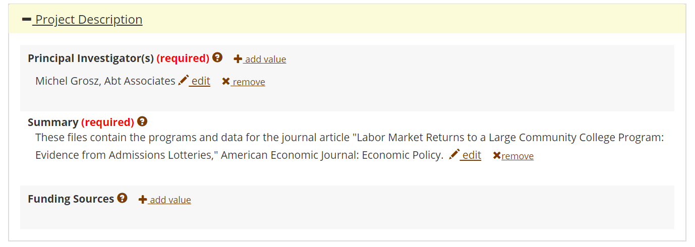

## Guidance on how to deposit data at the AEA Data and Code Repository

1. Start by following [instructions provided at the Repository](https://www.openicpsr.org/openicpsr/aea/deposit-instructions).
2. Upload files in the way you expect the files to be organized in order to run the code. It is possible to upload a ZIP file. Replicators will be downloading a ZIP file that preserves the directory structure.
  - Please upload the README (in PDF, TXT, or MD format) as the very first file - ensuring that it can be found easily by browsers of the archive.
  - Please upload the README to the root of the repository - any data and code can be in subdirectories, but it is easier to find the README if it is not in subdirectories.
3. Give the data/project a title:
  - The title should be "`Data and Code for: [Title of article]`"
### Describe the project:

  - The authors should be those who compiled the data and code. This may differ (if necessary) from the article. 
  - The summary might be short. It can include the abstract of the article itself. It does not need to include information on the related article (which has its own field). 
  - Identify any funding sources here - the information can be queried by some funders, and can assist with your award reporting.
### Additional metadata

  - Authors **MUST** provide JEL codes
  - We ENCOURAGE authors to provide additional subject terms
  - Authors **MUST** provide the Manuscript Number, as this will allow us to properly connect the repository with the manuscript.
  - When only code is produced, authors should choose `data type = program source code`: 

  - When data are provided, authors are ENCOURAGED to define 
    - the geographical scope 
    - the universe 
    - the time periods
    - data type
  - This information can also be provided when only code is made available.
  - Methodology is particularly relevant for survey or experimental data:
    - response rates, sampling rates, etc.
  - We ENCOURAGE all authors to define
    - the unit of observation (e.g. individual, firm, establishment, county, country)
### Related publications

Authors should add a placeholder here for their planned publication. The AEA editorial office will update these fields as additional information (publication year, volume, issue, DOI) become known.
- Authors can also link back to working papers or related publications that have or will use this (same!) data. 
- Future functionality will automatically list articles (including articles by third parties) that cite the data.
