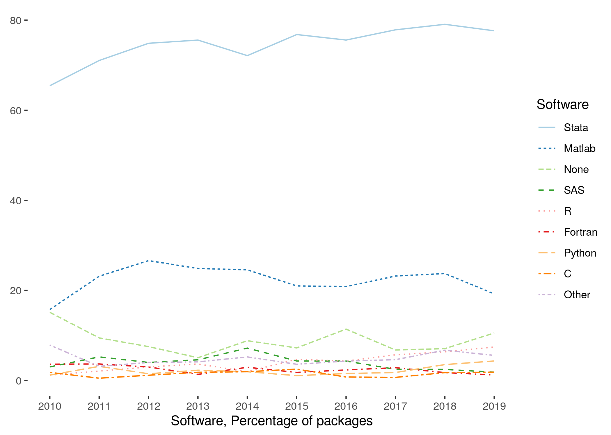

This document describes how to best **prepare a replication package** for an AEA journal. Much of the guidance here
is not specific to our journals - in fact, the document links to other websites for tutorials, best practices, etc. The best moment to do the preparation described here is, in fact, when you start the project, not once you have had your manuscript conditionally accepted. However, all steps here can and have been successfully performed at the point of conditional acceptance.

## Data Citations

All manuscripts will be checked for data citations. If you have not done so, now is the time to add them to your
manuscript. 

### What to cite

All datasets actively used in your replication package must be cited. Just as with any other literature, this serves to properly identify the provenance of the information you use, and attribution of credit to the original creator. Data you created should also be cited, either by pointing to a data deposit you made elsewhere, or by pointing to your own (forthcoming) data deposit at the AEA.

- [Guidance for data citations](https://social-science-data-editors.github.io/guidance/addtl-data-citation-guidance.html#distributor)
- [Guidance on how to cite the data you collected](data-deposit-aea.html#citing-your-deposit)


### Where to cite

Every citation has an in-text entry (`Smith (2020)` or `(Smith, 2020)`), and a list entry in the Reference section (see the [Chicago Manual of Style Quick Guide](https://www.chicagomanualofstyle.org/tools_citationguide/citation-guide-2.html)). This is true for data citations as well. 

- Your data citations should be listed in the Reference section of the manuscript. 

In rare circumstances, when there are too many data citations to accomodate succinctly, data citations for sources can be deferred to an online data appendix. In all cases, for clarity, all data citations should **also** appear in the README, including with a separate Reference section.

### Data citations and Data Availability Statements

In many cases, the data citation for a public-use dataset has a unique URL that is sufficient for downloading the dataset. However, in many other cases where the URL does not lead directly to the dataset, a separate "Data Availability Statement" needs to be provided, as part of the README. A simple data citation is not sufficient. See [additional guidance on data availability statements](https://social-science-data-editors.github.io/guidance/Requested_information_dcas.html).

## Describing the contents of your replication package

Every replication package requires a document outlining where the data comes from, what data is provided, what requirements are needed to run the code in the replication package, how to run the code, what results to expect, and where to find the results. This is conventionally called the "README". 

- The AEA requires that the README follow a prescribed schema.  Please use the [template README for social science replication packages](https://social-science-data-editors.github.io/guidance/template-README.html).

Follow the instructions within the template README, and provide it as part of your replication package.

## Ideal structure of a replication package

The AEA uses the openICPSR platform for replication packages. The platform allows users to download complete "deposits", or only subdirectories thereof. 

> Users should not upload ZIP packages as files - rather, ZIP files can be used to structure code and data, but should be unzipped on the platform ("import from ZIP"). 

The code and data should run as downloaded from openICPSR, without further manual modifications (creating empty subdirectories programmatically is acceptable). Because code tends to be small, but data can be large, we strongly advise to not commingle data and code - interested researchers can download  the code directory by itself if they wish, without also downloading a potentially very large data directory.

A simple template might be
```
README.pdf
data/
   raw/
      cps0001.dat
   analysis/
      combined_data.dta
      combined_data.csv
      combined_data_codebook.pdf
code/
  01_create/
      01_readcps.R
      02_readfred.R
  02_analysis/
      01_table1-5.R
      02_figures1-4.R
results/
  table1.tex
  table2.tex
  ...
  figure1.pdf
  figure2.pdf
```

If your paper uses restricted-access data, clearly separate the restricted from the open-access data, both in terms of the raw data as well as the processed data:

```
data/
   raw/
      cps0001.dat
   confidential/
      ssa.csv
   conf_analysis/
      confidential_combined.dta
```

Keep in mind that you may be able to provide a subset of your replication package privately to the AEA Data Editor, see  the [Sharing restricted-access data with the AEA Data Editor](sharing-restricted-data.md) page.

### No manual modifications

The replication package should reproduce the tables and figures, as well as any in-text numbers, by **running code without manual intervention**. 

> The only exception to this rule is a single change to set a small number of program and data directory paths.

While running a small number of distinct programs separately  is acceptable (in some cases even desirable), it is not acceptable to require replicators to manually enter numbers, or configure parameter files, in order to reproduce the tables and figures in the paper. Nevertheless, it should be clear from the manuscript and the code how a replicator might deviate from the tables and figures in the paper. 

### Structure in the presence of confidential (unpublished) data

When the replication package relies on confidential data that cannot be shared, authors will have to

- prepare a confidential (partial) replication package, to be archived wherever the confidential data is kept (see [this FAQ](https://social-science-data-editors.github.io/guidance/FAQ.html#how-can-i-ensure-that-the-confidential-data-is-preserved))
  - this would contain the contents of `data/confidential` and possibly `data/conf_analysis` from the example above.
- prepare a non-confidential replication package that contains all code, and any data that is not subject to publication controls
  - this would contain the contents of `data/raw`, `data/analysis`, `code/`, and for reference, `results/` from the example above.
- ensure that replicators have detailed instructions on how to combine the two packages 
- specify  which (if any) of the results in their paper can be reproduced without the confidential data. 

Authors might want to investigate the  possibility of providing "fake" data that might allow replicators to run code, without obtaining meaningful results (functionality test). 

The [Social Science Editors' FAQ](https://social-science-data-editors.github.io/guidance/FAQ.html#i-use-confidential-data-i-am-allowed-to-provide-the-data-to-the-data-editor-for-the-purpose-of-replication-but-you-are-not-allowed-to-publish-the-data-how-do-i-proceed) describes a related issue.


### Considering the replicator

The replicator of your package is likely to be less qualified than you are. After all, you are publishing something novel.

You should assume

- that the replicator has basic knowledge in how to run your software package, if the software is commonly used in economics
  - Stata, Matlab, some others are commonly used
  - Compiled or new computer languages are much less likely to be widely used, even if they are used in your subdiscipline



You can assume

- that the replicator can manipulate a top-level configuration file 
  - for instance, to set a base directory
  - but not setting a base directory at the top of 25 different files

You should NOT assume

- that the replicator will use the same type of operating system
  - describe any *hard* requirements, but do not impose any *fake* requirements
  - most Stata, Matlab, SAS, R, Python, etc. can run on any operating system, unless you hard-code platform-specific commands into your code 
- that the replicator has any of your packages/modules/etc. installed
  - provide a setup program to install these (not manual instructions). 
  - provide copies of such packages/modules when the package repository does not allow you to specify a version 
  - provide a container/ Docker image/ VM that comprises all the necessary software and libraries
- that the replicator will run the software the same way you do
  - some software can be run in different ways (interactive, batch, etc.) and may behave differently depending on how it s run. 
  - For instance, Stata will change the working directory to that of the program being run in batch mode, but not if running interactively
  - For instance, running R code using Rstudio may behave differently than running it with `rscript`

For less frequently used software, provide a URL where the software can be obtained. 
  - essentially, if not listed in the figure above, provide information on how to obtain software
  - if using commercial compilers, we also suggest to compile your code using open-source or free compilers (including any free performance packages, such as Intel MKL), even if the resulting code is not the most efficient.
  - as of 2021, the AEA Data Editor has access to the software on [this list](https://ciser.cornell.edu/computing/computing-account-software/), and any open-source (free) software that can be installed on Windows, Linux, and macOS.

## Re-run your replication package

Ideally, once you have prepared your replication package, you should re-run the code again, in a clean environment, possibly a fresh computer, to ensure that (a) the package is, in fact, reproducible with minimal interaction (b) the results are numerically identical. 

- Wherever possible, we strongly encourage running in batch (non-interactive) mode.

## Preparing to upload

Once you are done preparing your replication package, you should upload it:

- if you have received a conditional acceptance, your replication  package **must** be in a trusted repository. The default trusted repository is the [AEA Data and Code Repository](https://www.openicpsr.org/openicpsr/search/aea/studies). Other trusted repositories are acceptable (see [list](https://social-science-data-editors.github.io/guidance/Requested_information_hosting.html#trusted-repositories)), but replication packages should meet the [display guidelines](guidelines-other-repositories.md). 
- if you have confidential data that you want to transmit to the AEA Data Editor but do not want published, communicate with the AEA Data Editor directly (see [this FAQ](https://www.aeaweb.org/journals/data/faq#restricted)).
- if you have received instructions during the revise-and-resubmit process to have a reproducibility check conducted, you may use the AEA Data and Code Repository, but other methods are also acceptable. Do not forget, however, that once the paper is accepted, it **must** be made available on a trusted repository - other methods are then no longer acceptable.

## Final checklist

Before proceeding, do check:

- [ ] your manuscript includes data citations 
- [ ] you have prepared a README that provides all the relevant information, as per the [README template](https://social-science-data-editors.github.io/guidance/template-README.html) 
- [ ] your data and code deposit contains all code, including code to read in raw data, *even when the data cannot be provided*.
- [ ] your replication package has been re-executed, and reproduces the tables and figures in your manuscript faithfully.

## Next step

If you are ready, you can proceed to [upload to the AEA Data and Code Repository](data-deposit-aea.md).

