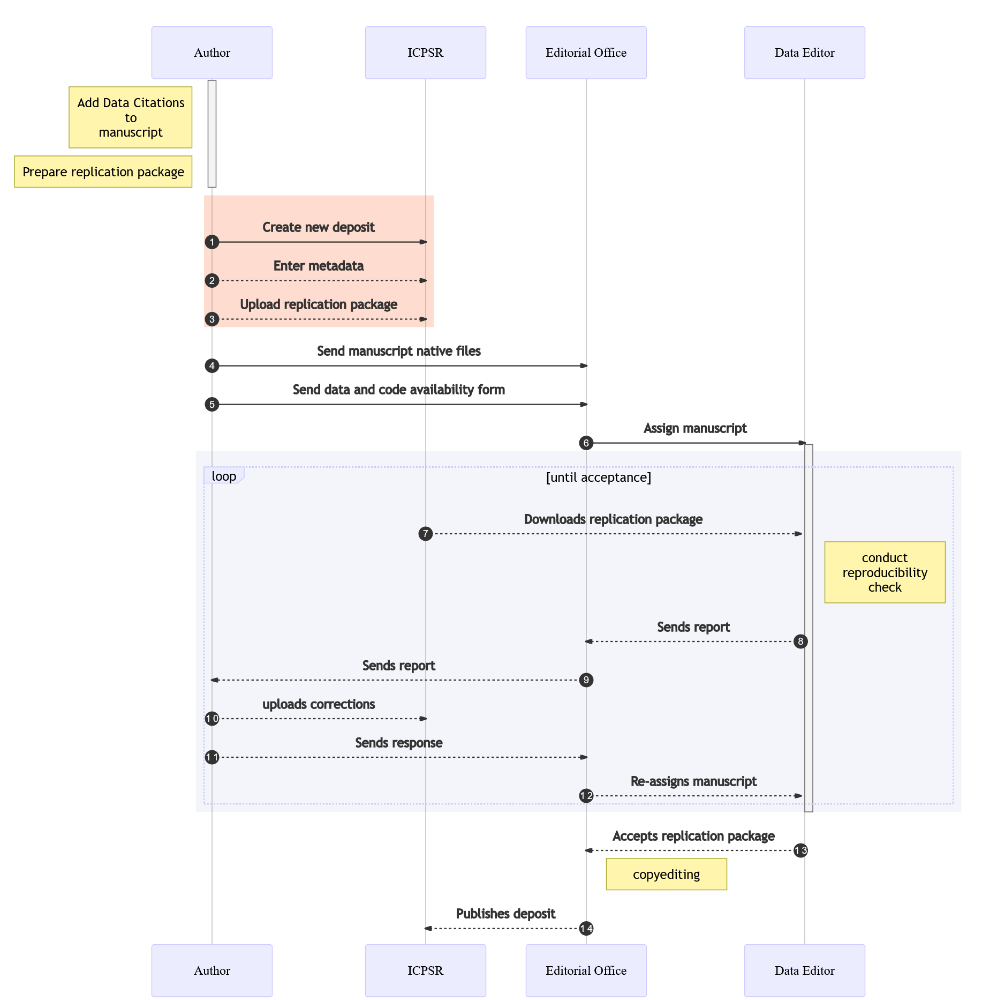

The following steps outline what you should expect after conditional acceptance of your manuscript, in compliance with the [AEA Data and Code Availability Policy](https://www.aeaweb.org/journals/policies/data-code):

1. [Prepare your data and code replication package](preparing-for-data-deposit.md) (including data citations and provenance information)
2. [Provide metadata and upload the replication package](data-deposit-aea.md), for verification and subsequently publication.
3. Submit the [Data and Code Availability Form](/assets/DataCodeAvailabilityForm_20200602.docx) together with your manuscript native files as instructed, and as per guidelines at your journal (for example, [AER guidelines](https://www.aeaweb.org/journals/aer/submissions/accepted-articles/styleguide)).
4. The editorial office assigns the manuscript to the AEA Data Editor.
5. The AEA Data Editor team downloads materials, [conducts reproducibility checks](https://social-science-data-editors.github.io/guidance/Verification_guidance.html) , writes [report](https://github.com/AEADataEditor/replication-template/blob/master/REPLICATION.md).
6. The report is communicated to the editorial office and the Editor of the journal.
   - If accepted, the manuscript is copy-edited, and published together with the data deposit as provided by the author.
   - If changes need to be made, the report is communicated to the authors, who make changes, until the replication package is accepted.

